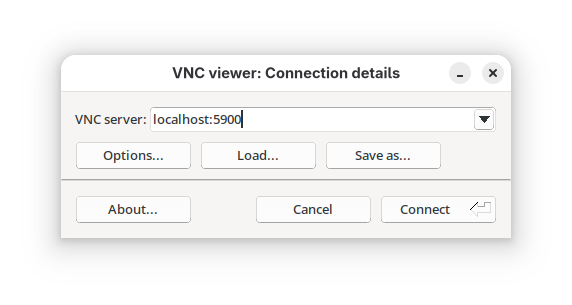
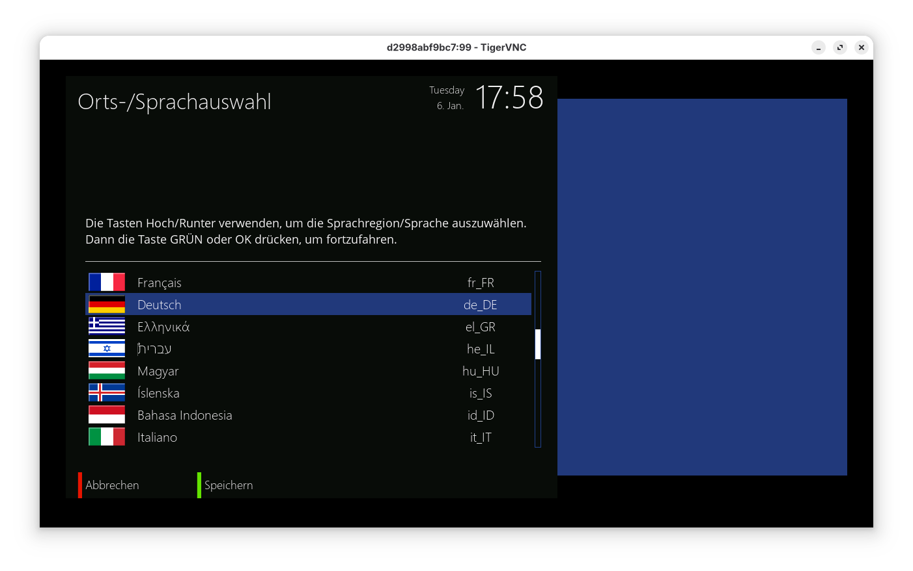

# Enigma2 XVFB Docker image - OpenATV 7.5

[](https://hub.docker.com/r/jbleyel/e2xvfbatv/builds)
[](https://hub.docker.com/r/jbleyel/e2xvfbatv)

> Fork from https://github.com/jbleyel/e2xvfb

I had to make some dirty hacks to be able to boot and run without any problems:
- VideoWizard from StartWizard.py was removed
- NetworkWizard was removed
- /usr/share/enigma2/groupedservices need to be converted from UTF-8 to ASCII

Run enigma2 application via SDL under Xvfb xserver.

# How to build the image

If you want to build image locally (now this is the only way) you have to run:
```bash
docker build -t e2xvfb-openatv:7.5 .
```

# How to run the image

If you want to be able to connect to the image with vnc first start it with
```bash
docker run --rm -p 5900:5900 --name enigma2_box e2xvfb-openatv:7.5 x11vnc -forever
```
Then to start enigma2 in the container use
```bash
docker exec -e ENIGMA_DEBUG_LVL=5 enigma2_box enigma2
```
> After language selection you have to run enigma2 with command above once again

Then you can connect to VNC for example with TigerVNC.

<p align="center">
  
  
</p>

Finally, to stop and remove the container use
```bash
docker stop enigma2_box
```

# Others
We also support `RESOLUTION` environment variable for Xvfb.

To allow ftp you need to add:
```
-p 21:21 -p 20:20 -p 21100-21110:21100-21110 
```
to docker run command.

To allow ssh you need to add:
```
-p 22:22
```
to docker run command.

# Environment
* Ubuntu 24.04
* openATV enigma2 branch 7.5
* Python 3.12
* default and MetrixHD skin
* several enigma2-plugins and oe-aliance-plugins

